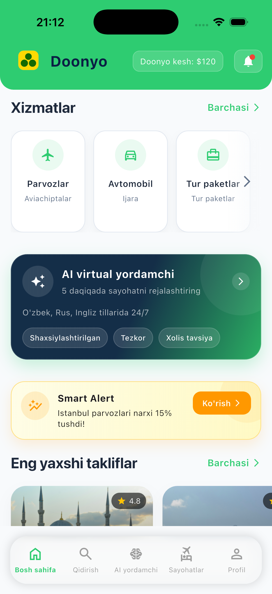
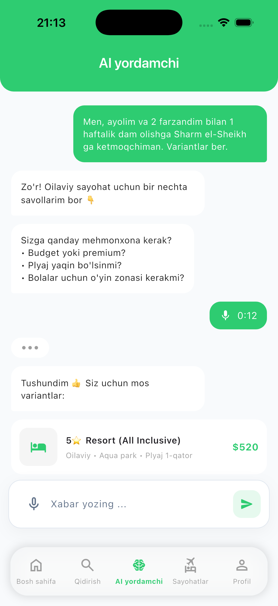
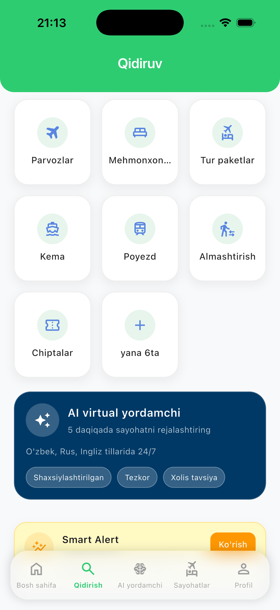
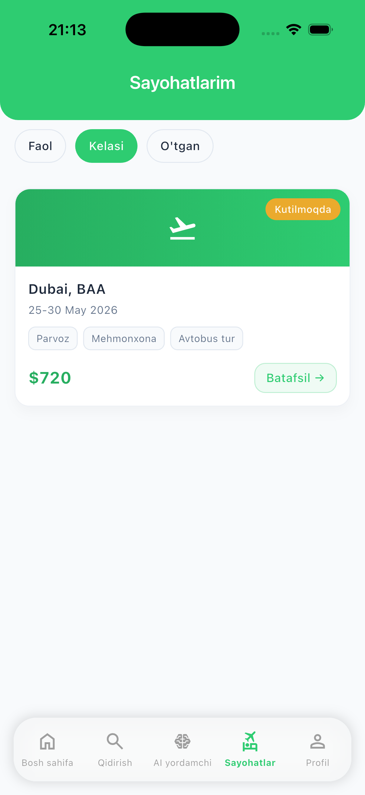
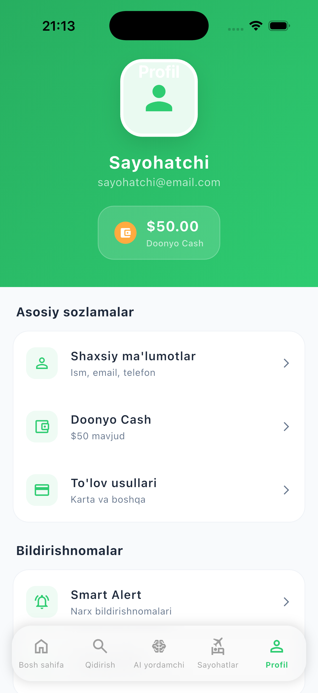
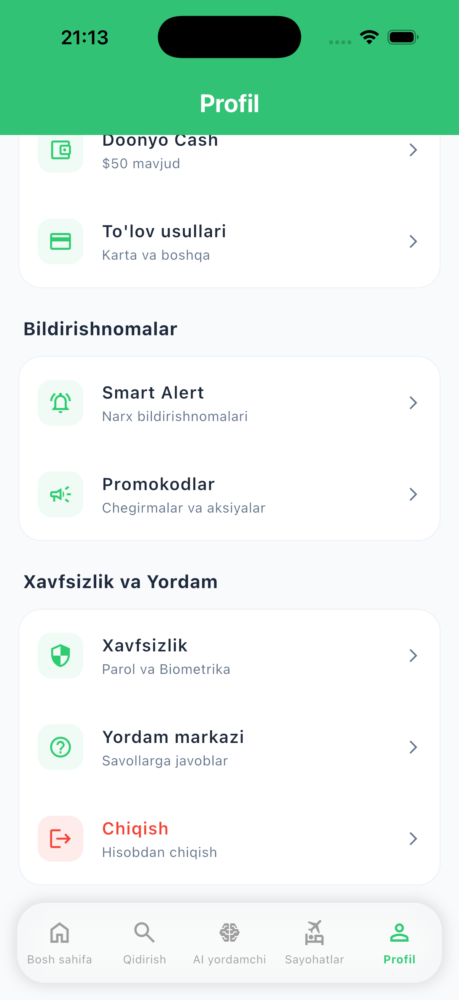

# 🌍 Mundo Mobile — Travel & AI Assistant App

Mundo Mobile is a modern **travel booking application** built with Flutter, designed to provide users with a seamless experience for exploring destinations, booking services, and interacting with an AI-powered assistant.

---

## ✨ Features

* ✈️ **Travel Services**

  * Flights
  * Hotels
  * Tours & Activities
  * Transport (Car, Train, Bus)

* 🤖 **AI Assistant**

  * Smart travel recommendations
  * Chat-based UI (modern messaging experience)
  * Voice & text interaction ready

* 💳 **Doonyo Pay**

  * Installment-based payment system
  * Clean fintech UI integration

* 🔎 **Search System**

  * Explore destinations
  * Smart filtering (planned)

* 📊 **Modern UI/UX**

  * Minimalistic design
  * Smooth animations
  * Reusable design system (AppColors, Widgets)

---

## 🏗️ Architecture

This project follows a **scalable and clean architecture** approach:

```
lib/
│
├── core/
│   ├── constants/        # AppColors, themes
│   ├── widgets/          # Reusable UI components
│   └── navigation/       # GoRouter setup
│
├── features/
│   ├── home/
│   ├── search/
│   ├── booking/
│   ├── profile/
│   └── ai/               # AI Assistant module
│
└── main.dart
```

* **State Management:** (GetX / Riverpod - depending on usage)
* **Navigation:** GoRouter (StatefulShellRoute)
* **Design System:** Centralized (AppColors + reusable widgets)

---

## 🎨 Design System

* 🌿 Primary Color: `#2ECC71`
* 🌊 Secondary: `#3498DB`
* 🌅 Accent: `#FFA726`
* ⚪ Background: `#F8FAFC`

Reusable components:

* `AppInput` (global input field)
* `ServiceCardWidget`
* `TravelCardWidget`
* `DoonyoPayWidget`
* `AI Chat UI components`

---

## 🚀 Getting Started

### 1. Clone the repo

```bash
git clone https://github.com/your-username/mundo-mobile.git
cd mundo-mobile
```

### 2. Install dependencies

```bash
flutter pub get
```

### 3. Run the app

```bash
flutter run
```

---

## 📱 Screens

* Home Screen (services + offers)
* Search Screen
* AI Assistant Screen (chat UI)
* Booking Screen
* Profile Screen

---

## 🧠 Future Improvements

* 🔥 Real AI integration (OpenAI / streaming responses)
* 🎤 Voice recognition
* 💾 Chat history (Firebase / local DB)
* 🌍 Multi-language support
* 💳 Payment gateway integration

---

## 📸 Preview

<p align="center">
  
  
  
</p>


<p align="center">
  
  
  
</p>

---

## 🤝 Contributing

Contributions are welcome!

1. Fork the repo
2. Create a new branch
3. Make changes
4. Submit a pull request

---

## 📄 License

This project is open-source and available under the MIT License.

---

## 👨‍💻 Author

**Nodirbek Narzullayev**

* Flutter Developer
* Passionate about clean architecture & modern UI

---

## ⭐ Support

If you like this project, give it a ⭐ on GitHub!
